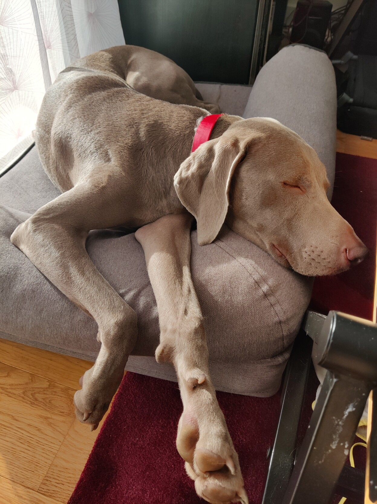

# Centered title

---

# Centered title even when it's long and spans multiple lines

---

# Centered [[incremental]{}]{.incremental} title

---

# Top title

- With
- content

---

# Top title

::: incremental
- a
- b
- c
:::

---

# [Jumbo text]{.jumbo}

---

::: jumbogroup

## [a group of]{.jumbo}
## [big jumbo text]{.jumbo}
## [because it's fun]{.jumbo}

::::::::::

---

# Color switch []{.make-alternate}

---

```haskell
test :: Test
test = do
  traverse (`xor` b) [test]
  
```

---

# Titles are centered correctly even in the presence of notes

::: notes
| notes that are displayed because the right flag is added to the pandoc
| invocation. The leading `|` character allows to preserve line breaks,
| that's convenient in notes.
| notes can be toggled with `n`
:::

---

:::bigimage

:::
